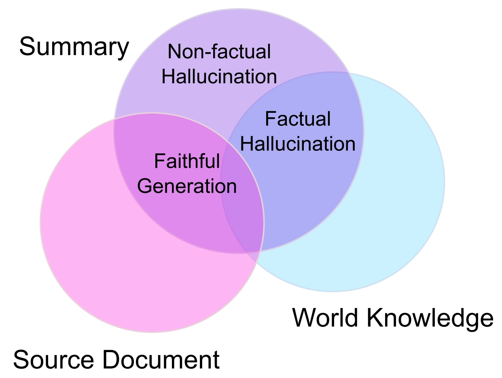

# Hallucination

Learning Materials for Hallucination in Generative Models

<!--  -->

  
  <!-- <em>Hallucinated but Factual! Inspecting the Factuality of Hallucinations in Abstractive Summarization</em> -->

## Table of Contents

- [Language](#language)
  - [Survey](#survey)
  - [Paper List](#paper-list)
- [Vision](#vision)
  - [Paper List](#paper-list-1)
  - [Benchmarks](#benchmarks)
- [References](#references)

## Language

### Survey

-  Survey of Hallucination in Natural Language Generation, 2022

   

summary

    * Metrics (sec4):
      * Statistical: PARENT, PARENT-T1, Knowledge F1, BVSS
      * Model-based: IE-based, QA-based, NLI-based, Faithfulness Classification, LM-based
      * Human Evaluations
    * Method (sec5)
      * Data
      * Model:
        * architecture
        * training: (1) Planning/Sketching (2) RL (3) Multi-task Learning (4) Controllable Generation
    * Tasks: summarization, dialogue generation, Generative QA, Data-to-Text Generation, Neural Machine Translation, Vision-Language Generation

  

### Paper List

-  (2023.03) GPT4 Technical Report, *OpenAI*

   

summary

    - methods ( Sec2.2, Sec3.1):
      - Open-domain Hallucination (~extrinsic): flagged as not factual data + additional labeled comparison data -> reward model
      - Closed-domain Hallucination (~intrinsic):
        1. get the result: prompt -> response
        2. find hallucination: prompt + response -> hallucination
        3. modify the hallucination: prompt + response + hallucinations -> rewrite
        4. evaluate the hallucination: prompt + response -> hallucination ?: yes-> repeat; no -> get comparison pair -> reward model

  

## Vision

note1: *Benchmark[# of query/# of image]*

note2: *MCQA = Multiple Choice Question Answer, BinQA = Binary Question Answer*

### Evaluation and Benchmarks

Object Hallucination

- [1809.02156](https://arxiv.org/abs/1809.02156) | Object Hallucination in Image Captioning, EMNLP 2018, [Hallucination](https://github.com/LisaAnne/Hallucination), `Evaluation: CHAIR Metric(hallucinated object percent)`

- [2305.10355](https://arxiv.org/abs/2305.10355) | POPE: Polling-based Object Probing Evaluation for Object Hallucination, EMNLP 2023, [POPE](https://github.com/RUCAIBox/POPE), `Benchmark[3000/500]: BinQA`

- [2308.15126](https://arxiv.org/abs/2308.15126) | Evaluation and Analysis of Hallucination in Large Vision-Language Models, [HaELM](https://github.com/junyangwang0410/HaELM), `Evaluation: LLM + BinQA`

- [2310.01779](https://arxiv.org/abs/2310.01779) | HallE-Switch: Controlling Object Hallucination in Large Vision Language Models, [CCEval](https://github.com/bronyayang/HallE_Switch), `Evaluation: LLM + CHAIR`

- [2310.05338](https://arxiv.org/abs/2310.05338) | Negative Object Presence Evaluation (NOPE) to Measure Object Hallucination in Vision-Language Models, `Benchmark[29.5k]: negative pronoun`

- [2311.03287](https://arxiv.org/abs/2311.03287) |  Holistic Analysis of Hallucination in GPT-4V(ision): Bias and Interference Challenges, [Bingo](https://github.com/gzcch/Bingo), `Benchmark[370/308]: VQA`

- [2312.03631](https://arxiv.org/abs/2312.03631) | Mitigating Open-Vocabulary Caption Hallucinations, [OpenCHAIR](https://assafbk.github.io/mocha/), `Evaluation: SYN -> open vocabulary`

- [2403.08542](https://arxiv.org/abs/2403.08542) | AIGCs Confuse AI Too: Investigating and Explaining Synthetic Image-induced Hallucinations in Large Vision-Language Models, `Analysis: synthesis->hallucination`

- [2404.02904](https://arxiv.org/abs/2404.02904) | ALOHa: A New Measure for Hallucination in Captioning Models, NAACL 2024, [ALOHa](https://davidmchan.github.io/aloha/), `Evaluation: LLM + parse + similarity`

Other Hallucination

- [2306.14565](https://arxiv.org/abs/2306.14565) | Mitigating Hallucination in Large Multi-Modal Models via Robust Instruction Tuning, ICLR 2024, [GAVIE](https://github.com/FuxiaoLiu/LRV-Instruction), `Evaluation: LLM`

- [2308.06394](https://arxiv.org/abs/2308.06394) | Detecting and Preventing Hallucinations in Large Vision Language Models, AAAI 2024, [M-HalDetect](https://github.com/hendryx-scale/mhal-detect), `Benchmark[3200]: accurate, inaccurate, analysis, unsure`

- [2309.02301](https://arxiv.org/abs/2309.02301) | CIEM: Contrastive Instruction Evaluation Method for Better Instruction Tuning, `Benchmark[78K]: pair-wised`

- [2309.14525](https://arxiv.org/abs/2309.14525) | Aligning Large Multimodal Models with Factually Augmented RLHF, [MMHal-Bench](https://huggingface.co/datasets/Shengcao1006/MMHal-Bench), `Benchmark[96]: attr, adv, comparison, counting, spa-rel, environ, holistic, other`

- [2311.01477](https://arxiv.org/abs/2311.01477) | FAITHSCORE: Evaluating Hallucinations in Large Vision-Language Models, [FAITHSCORE](https://github.com/bcdnlp/FAITHSCORE), `Evaluation: atomic facts`

- [2311.03287](https://arxiv.org/abs/2311.03287) | Holistic Analysis of Hallucination in GPT-4V(ision): Bias and Interference Challenges, [Bingo](https://github.com/gzcch/Bingo), `Benchmark[370/308]: bias(region, ocr, factual), inference(i2i, t2i)`

- [2311.07397](https://arxiv.org/abs/2311.07397) | AMBER: An LLM-free Multi-dimensional Benchmark for MLLMs Hallucination Evaluation, [AMBER](https://github.com/junyangwang0410/AMBER), `Benchmark[1004]: exist, attr, rel`

- [2311.16479](https://arxiv.org/abs/2311.16479) | Mitigating Hallucination in Visual Language Models with Visual Supervision, `Benchmark[1500]: BinQA(category, attr, rel)`

- [2312.01701](https://arxiv.org/abs/2312.01701) | Mitigating Fine-Grained Hallucination by Fine-Tuning Large Vision-Language Models with Caption Rewrites, [FOHE](https://github.com/Anonymousanoy/FOHE), `Evaluation: BinQA(obj, attr, behavior)`

- [2312.02219](https://arxiv.org/abs/2312.02219) Behind the Magic, MERLIM: Multi-modal Evaluation Benchmark for Large Image-Language Models, [MERLIM](https://github.com/ojedaf/MERLIM), `Benchmark[279K]: VQA(obj, rel, count)`

- [2401.06209](https://arxiv.org/abs/2401.06209) |  Eyes Wide Shut? Exploring the Visual Shortcomings of Multimodal LLMs, [MMVP](https://tsb0601.github.io/mmvp_blog/), `Benchmark[300/300]: pair-wised, capability rather hallucination`

- [2402.03757](https://arxiv.org/abs/2402.03757) | The Instinctive Bias: Spurious Images lead to Hallucination in MLLMs, [CorrelationQA](https://github.com/MasaiahHan/CorrelationQA), `Benchmark[1K/7K]: LLM+SYN-eval, taxonomy(color, city, sports, etc.)` 

- [2402.09717](https://arxiv.org/abs/2402.09717) | Visually Dehallucinative Instruction Generation: Know What You Don't Know, `Benchmark[7K]: unanswerable, false Q, don't know, not sure`

- [2402.03190](https://arxiv.org/abs/2402.03190) | Unified Hallucination Detection for Multimodal Large Language Models, [EasyDetect](https://openkg-org.github.io/EasyDetect), `Benchmark[200+220/420]: LLM-Eval, T2I/I2T(obj, attr, scene, fact)`

- [2402.13220](https://arxiv.org/abs/2402.13220) | How Easy is It to Fool Your Multimodal LLMs? An Empirical Analysis on Deceptive Prompts, `Benchmark[850/850], deceptive question + object, scene, relation, visual-confusion`

- [2402.14683](https://arxiv.org/abs/2402.14683) | Visual Hallucinations of Multi-modal Large Language Models, [VHTest](https://github.com/wenhuang2000/VHTest), `Benchmark[1200/1200]: Synthesis Image + QA`

- [2402.15721](https://arxiv.org/abs/2402.15721) | Hal-Eval: A Universal and Fine-grained Hallucination Evaluation Framework for Large Vision Language Models, `Evaluation: LLM, event hallucination`

- [2403.11116](https://arxiv.org/abs/2403.11116) | PhD: A Prompted Visual Hallucination Evaluation Dataset, [IntrinsicHallu](https://github.com/jiazhen-code/IntrinsicHallu), `Benchmark[53k/7k]: obj, attr, conflict, common-sense`

Illusion

- [2310.14566](https://arxiv.org/abs/2310.14566)  | HallusionBench: An Advanced Diagnostic Suite for Entangled Language Hallucination & Visual Illusion in Large Vision-Language Models, [HALLUSIONBENCH](https://github.com/tianyi-lab/HallusionBench), `Benchmark[1129/346]: Illusion + BinQA`

- [2403.15952](https://arxiv.org/abs/2403.15952) | IllusionVQA: A Challenging Optical Illusion Dataset for Vision Language Models, [IllusionVQA](https://github.com/csebuetnlp/IllusionVQA), `Benchmark[435/370]: Illusion + MCQA`

### Mitigating Methods

- [2306.14565](https://arxiv.org/abs/2306.14565) | Mitigating Hallucination in Large Multi-Modal Models via Robust Instruction Tuning, ICLR 2024 [LRV-Instruction](https://github.com/FuxiaoLiu/LRV-Instruction), `Dataset[1000/1000]: Robust Instruction (obj, knowledge)`

### Benchmarks

| Benchmark                                                   | Task         | Data                                                       | Paper                                                                                                                               | Preprint                                    | Publication | Affiliation |
| ----------------------------------------------------------- | ------------ | ---------------------------------------------------------- | ----------------------------------------------------------------------------------------------------------------------------------- | ------------------------------------------- | ----------- | ----------- |
| [HALLUSIONBENCH](https://github.com/tianyi-lab/HallusionBench) | VQA (binary) | 1129 QA, 346 images, self-collect (multiple domain)        | HallusionBench: An Advanced Diagnostic Suite for Entangled Language Hallucination & Visual Illusion in Large Vision-Language Models | [2310.14566](https://arxiv.org/abs/2310.14566) |             | UMD         |
| [Bingo](https://github.com/gzcch/Bingo)                        | VQA          | 370 QA, 308 images, self-collect (object-hallucination)    | Holistic Analysis of Hallucination in GPT-4V(ision): Bias and Interference Challenges                                               | [2311.03287](https://arxiv.org/abs/2311.03287) |             | UNC         |
| [GAVIE](https://github.com/FuxiaoLiu/LRV-Instruction)          | VQA          | 1000 QA, 1000 images, Visual Genome (object-hallucination) |    Mitigating Hallucination in Large Multi-Modal Models via Robust Instruction Tuning                                                                                                                                 |                    [2306.14565](https://arxiv.org/abs/2306.14565)                         |       ICLR 2024      |    Microsoft         |
| [POPE](https://github.com/RUCAIBox/POPE)                       | VQA (binary) | 3000 QA, 500 images, MSCOCO (object-hallucination)         | POPE: Polling-based Object Probing Evaluation for Object Hallucination                                                              | [2305.10355](https://arxiv.org/abs/2305.10355) | EMNLP 2023  | RUC         |

## Related Collections

- [llm-hallucination-survey](https://github.com/HillZhang1999/llm-hallucination-survey) , Reading list of hallucination in LLMs. Check out our new survey paper: "Siren’s Song in the AI Ocean: A Survey on Hallucination in Large Language Models"
- [awesome-hallucination-detection](https://github.com/EdinburghNLP/awesome-hallucination-detection) , List of papers on hallucination detection in LLMs.
- [Large MultiModal Model Hallucination](https://github.com/xieyuquanxx/awesome-Large-MultiModal-Hallucination) , up-to-date & curated list of awesome LMM hallucinations papers, methods & resources.
- [Awesome MLLM Hallucination](https://github.com/showlab/Awesome-MLLM-Hallucination) , A curated list of resources dedicated to hallucination of multimodal large language models (MLLM).
